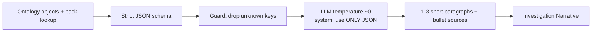

# AIP (later, reigned in)

You want a tightly scoped AIP so it does not hallucinate. That is the right instinct. **Do not wire it until hop-1 is a sentence a human would say without a model.**

The desk tab is already named "AI analyst." Today it is honest: it dumps a **JSON brief** from objects and says AIP is not wired. Keep that honesty until the function can only speak from that brief.

## The product rule

AIP emits **the sentence** (or a short paragraph of sentences), not a novel, not a score.

Allowed:

> In the last 365 days this seed received 0.013 ETH once, from Tornado Cash (mixer, official pack, cited). No OFAC SDN in hop 1. Working set is otherwise unlabeled.

Forbidden:

> Risk score 73. This wallet is likely a mule. AI thinks the unlabeled counterparty is an OTC desk. Funds then hopped through three mixers.

If a fact is not in the brief, the model may not say it. Unlabeled stays unlabeled. Missing label is not clearance.

## What exists today (do not confuse with the plan)

1. **Desk JSON brief** (`CaseView` `brief` useMemo): case id, seed, chains, window, counts, truncation flag, selected address, top counterparties' flows, token mix. It still includes `highRiskAddressCount` from the object -- that field should stay null. The brief should eventually include pack names/categories/sources for the top counterparties (it does not yet; names are on the Addresses tab, not in this JSON).

2. **`generate-narrative` action** -- placeholder, "will be backed by AIP Logic in a future phase."

3. **`RensicIntelligence` in functions** -- calls Claude with a long system prompt. `analyzeRisk` asks for 0-100. `traceMultiHop` walks hop 2-3. **This is the wrong shape for v1.** Grounding text in the prompt is not a guarantee. Do not pin these to the desk.

4. **Investigation Narrative object** -- the right place to **save** a paragraph plus `sources`. Keep using it when AIP lands.

## v1: no model required

Assemble English from the same fields `seedExposureLine` and the rail already use:

```
window + seed + hop-1 size
+ official sanctions/mixer hits (name, source_url)
+ largest native counterparties (name or unlabeled)
+ truncated? yes/no
```

Ship that as the AI tab body. If it is wrong, the bug is in ranking/pack, not in a model. This is the brief the LLM must consume later.

## v2: model as paraphraser only



Contract:

- Input schema is closed. No "also fetch hop 2."
- Output schema is closed: `paragraphs[]`, `sourceUrls[]`, `usedFields[]`. If the model adds `riskScore`, discard the run.
- System prompt: you may rephrase; you may not add counterparties, categories, or numbers that are not in JSON.
- Temperature low. Max tokens small (a paragraph, not 3000).
- Show the JSON next to the paragraph so a reviewer can diff.

That is "tightly scoped AIP." It is boring. Boring is the point.

## What never goes in the prompt

- "Assign a risk score 0-100"
- Peeling-chain / layering / "mule" language unless those words appear in investigator notes
- Community nametags presented without the unofficial caveat
- Addresses not in the working set
- USD conversions
- Hop 2+ unless you first build a **deterministic** path object and put it in the JSON (you will not, for the demo)

## Golden Hammer reminder

Do not use AIP to:

- Replace the pack (models do not cite OFAC XML)
- Replace Spark aggregations (sums belong in the pipeline)
- Replace Flag (humans name the OTC desk)

Use AIP to **say the case file out loud**. Palantir's structural guidance even suggests capturing LLM metadata (confidence, source, reasoning) on a struct or linked object -- Investigation Narrative is that parking spot.

## When to actually start v2

All of these are true:

1. Quiet-wallet demo produces the Tornado sentence without a model.
2. Official sanctions/mixer sort + chips cannot be missed.
3. Brief JSON includes pack `name`, `category`, `tier`, `sourceUrl` for every counterparty it mentions.
4. `analyzeRisk` is either rewritten to refuse scores or not pinned.

Until then, the AI tab stays a JSON preview. That is a feature.
