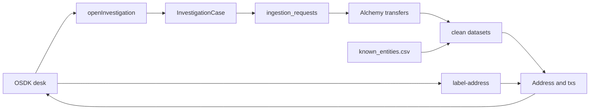

# Architecture

Alchemy transfers to Spark transforms to ontology to OSDK desk to TypeScript functions.
Not a SuperRepo. No invented risk scores as the product.

## Data flow

## Window to fromBlock

Lookback days (clamped 1-365) become:
fromBlock = hex(latest - lookback_days * blocks_per_day)
toBlock = latest
Ethereum about 7200 blocks/day; L2s about 43200. Hop 1 only.

## Identity vs membership

- Address = global wallet identity (chain:0x)
- Case Address = membership in this case
- Investigation Case = session (seed, chains, window)
