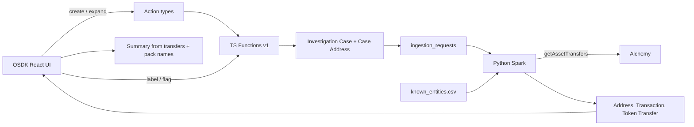

# Architecture

Rensic turns Alchemy transfer JSON into a Foundry **file** a person can read: one wallet, one window, named addresses, fund flow.

The product question is small on purpose:

> One wallet. One time window. Who did they touch directly, and which of those already have a name I can cite?

Everything below exists to answer that without inventing risk scores or drowning in hop-2 noise.

## End to end

Happy path in words:

1. You open a **file** (title, seed wallet, chain, lookback days).
2. A function writes an **Investigation Case** and a hop-0 **Case Address** for the seed. Those are the ontology type names in Foundry.
3. The next pipeline build snapshots open files into **ingestion requests**.
4. Spark calls Alchemy for transfers in that window (hop 1 only), joins the public pack where it can, and writes clean datasets.
5. Those datasets back ontology objects the UI reads over OSDK.
6. You rank fund flow, open ledgers, flag a note, or write a **Summary** grounded in the same facts.

## Three packages, plus Foundry-native pieces

| Package | Role | How it reaches production |
|---|---|---|
| `rensic-app` | Vite + React OSDK UI | Commit, push, **git tag** for the hosted site |
| `rensic-foundry` | TypeScript Functions v1 | Commit, push, **publish** a version, **pin** actions |
| `rensic-ingestion` | Python Spark transforms + entity pack CSV | Commit, push, **build** the pipeline |

Pushing `master` alone is not enough. Tag, publish, pin, and build are separate knobs.

These do **not** live as folders you can clone from this GitHub repo:

- Object, link, and action types (Ontology Manager / classic Compass)
- Dataset files and materializations
- Magritte / network egress / secrets
- The Developer Console application record

Rensic is **classic Compass**, not a SuperRepo. There is no `ontology.mts` encoding the model in git.

## Ontology shape (identity vs membership)

Palantir's useful rule here: model the world, and split **identity** from **observation**.

| You say | Object type | Why |
|---|---|---|
| "this file" | Investigation Case | Seed, chains, window, status |
| "this wallet on Ethereum" | Address | Global identity, key like `ethereum:0x...` |
| "this wallet in my file as hop 1" | Case Address | Membership: hop, role, case-scoped ETH |
| "this native transfer" | Transaction | On-chain event |
| "this USDC movement" | Token Transfer | Token event |
| "the writeup" | Investigation Narrative | Saved summary body / sources |
| "Alchemy key for this chain" | Chain Configuration | RPC config, not a wallet |

**Address** is the wallet whether or not a file exists. **Case Address** is "this wallet belongs in this file at hop N." That split keeps global labels and file-scoped flow from collapsing into one kitchen-sink object.

Links are mostly object-backed through Case Address and file-scoped transfer objects, not a giant freeform graph dump.

## UI surface

The chrome noun is **file**.

Tabs that matter for the demo:

- **Fund flow**: ETH between the file wallet and each address it traded with
- **Addresses**: working set: seed pinned, labeled rows first, then by flow (capped so a Vitalik-scale hop-1 dump is not the product)
- **Transactions** / **Token transfers**: line-by-line ledgers for the file wallet in the window
- **Summary**: short paragraphs from transfers and public names. Optional save onto the Investigation Narrative. Local grounded paraphrase is the reliable path.

Workshop is not the product. Object Explorer is for debug. A busy Vertex redraw of hop-1 was tried and dropped for the portfolio cut. Hop-2 was scoped out on purpose: hop-1 on a 30-day busy wallet is already enough blast radius.

## Window and hop-1

Lookback days (clamped to values like 7 / 30 / 90 / 365) become Alchemy `fromBlock` / `toBlock`:

- Roughly `fromBlock = latest - lookback_days * blocks_per_day`
- Ethereum ~7200 blocks/day. Faster L2s use a higher constant.

Ingest is **hop 1 only**: the seed and addresses it traded with in that window. That is the working set the UI ranks.

Alchemy has a transfer page cap (~200k). Busy public wallets can truncate. The UI should say when that happened. Truncation is a stress test, not a complete history.

## Entity pack

`known_entities.csv` ships with ingestion (~5.5k rows today):

- **Official** (~1.1k): cited sources (sanctions lists, protocol docs, proof-of-reserve style references, and similar)
- **Community** (~4.4k): useful but caveated (for example community nametags)

Rules that keep the product honest:

- A name on screen should carry a source, be a label you set, or stay unlabeled
- Unlabeled is valid. Missing label is not clearance
- Community names are not "Coinbase official"
- Official pack names are not freely renamed from the UI

Spark joins what it can onto addresses. The UI also reads pack metadata for categories and source URLs when showing Summary and chips.

## Functions and actions

Kinetic layer (how the world changes under governance):

- Open / create a file
- Expand window or refresh ingest
- Label / flag an address
- Delete a file (cascade cleanup for file-scoped objects)
- Save narrative text when Summary is written to the file

Pipelines compute. People decide. Functions back the actions the UI calls through OSDK.

## Summary (grounded read)

Summary builds a closed brief from the file's transfers and pack / user labels, then turns that into short readable lines (intro, then biggest by ETH moved, one line each). It must not invent counterparties, hops, or scores.

Calling a Foundry AIP Agent from the UI was explored. On this Dev enrollment the reliable demo path is the local grounded paraphrase. The tab copy stays quiet about agents and RIDs.

## How a change ships

1. **UI**: change `rensic-app`, push Stemma, tag (for example `0.1.23`). Hosted site follows the tag.
2. **Functions**: change `rensic-foundry`, push, publish a functions version, pin the action types to that version.
3. **Ingest / pack**: change `rensic-ingestion`, push, build the pipeline, confirm ontology datasets updated.

Local Vite uses `VITE_FOUNDRY_API_URL=http://localhost:8080` so the Vite proxy can forward `/api` and `/multipass` to the enrollment. Production env points at the Foundry host directly.

## Design fences

In scope for this portfolio cut:

- One seed, hop-1, named working set, fund flow, ledgers, grounded summary
- Sourced dual-tier pack
- Classic Foundry ontology + OSDK UI + TS functions + Spark

Out of scope on purpose:

- Competing with Chainalysis / TRM clustering
- Etherscan-with-a-dark-theme
- Invented behavioral risk scores
- Hop-2 as a product tab
- SuperRepo / `ontology.mts` migration just to look more official

If a new idea does not help the 30-second true sentence, it is decoration.

## Related

- Specs (tighter contracts): [specs/](specs/)
