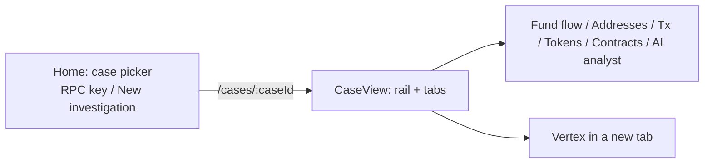
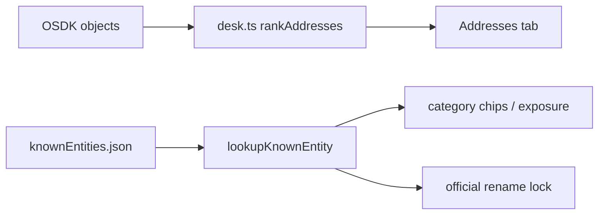

# The desk (OSDK UI)

The product UI is the React app in `~/Documents/WilderformTools/rensic/rensic-app`. Palantir Workshop is not the product. Object Explorer is a debug tool. Vertex is a **button** that opens Foundry's graph on a **slice**.

Stack: Vite, React, `@rensic/sdk` (OSDK), Palantir Blueprint-ish spacing (24px, intent, mono on data), dusty copper as the one accent. Foundry hosting mangles fancy unicode -- stick to ASCII `...` in UI copy if you hit that.

Local: `npm run dev` -> `http://localhost:8080`. Hosted site updates on **git tag**.

## Screens

`Home.tsx` -- list cases, popovers for RPC and create. Create calls `create-investigation` with title, seed, chain, `time-window-days` clamped to 7/30/90/365.

`CaseView.tsx` -- the desk. Loads Case Address rows, ranks them, locks selection so other tabs follow that address.

`desk.ts` -- ranking, working set cap (100), Vertex cast cap (16), page-cap constant (200000), window labels. Keep product rules here so tests can pin them (`desk.test.ts`).

`knownEntities.ts` -- pack lookup, official vs community, `seedExposureLine()` (the 30-second sentence helper).

## Working set (the anti-Vitalik rule)

Alchemy may return tens of thousands of hop-1 addresses. The Addresses tab is not that dump.

- Seed is **pinned**.
- Then **labeled** rows (pack or investigator) above unlabeled.
- Then ETH flow (in+out), then tx count.
- Cap **100** counterparties in the list the human ranks through (`WORKING_SET_CAP`).

Copy on the rail: `Working set: seed + top 100 by ETH in this window (N labeled).`

If a 0.00001 ETH OFAC hit is labeled, it sorts **above** a 50 ETH unlabeled flow. That is the point. Volume must not hide a sourced sanctions/mixer chip.

## Rail (what must stay honest)

| Row | Meaning |
|---|---|
| Window | `Nd` from case start/end. Plus `windowFact`: fetched Nd, or page-cap warning |
| ETH moved | Seed in+out in **this case** |
| Addresses / Txns | Case-scoped counts |
| Labeled risk | Count of working-set rows whose pack category is `sanctions` or `mixer` |
| Exposure line | `seedExposureLine`: "Direct to mixer (...)", "Direct to OFAC SDN", "No labeled counterparties..." |
| Risk | Stays `-` unless `overallRiskLevel` is set. It should not be set. |

**Watch:** labeled risk currently counts **any** sanctions/mixer, including **community** mixers (there are a handful). Official-only is the tighter product. Community nametags should not bump the danger count without a caveat.

## Flag (investigator layer)

Not the case action `flag-for-review`.

Flag writes `Address.addressLabel` via `label-address`.

| Pack tier | UI |
|---|---|
| Official | Rename blocked. Note required. Display keeps pack name; note is `my note`. |
| Community | Investigator name may override display; pack stays on hover. |
| Unlabeled | Write a name; optional note. |

Pack category is never overwritten. OFAC stays OFAC.

Limitation: the label is **global on Address**, not case-scoped. Two cases sharing a wallet share the investigator string. If that gets painful, store notes on Case Address (`inclusionReason` already exists) instead of adding a new type.

## Tabs

| Tab | Honest job |
|---|---|
| Fund flow | Vertex for **selected** Address RID. Cast = seed + labeled hop-1 + fill by ETH up to 16. Not 91k nodes. |
| Addresses | Working set. Click locks selection. |
| Transactions | Native ETH involving the selected address in this case |
| Token transfers | ERC-20 / NFT / 1155 for that address |
| Contracts | Contract touches for that address (thin Alchemy projection, not full ABI) |
| AI analyst | JSON brief from objects. **AIP is not wired.** Unlabeled stays unlabeled. |

Tab blurbs in the UI are the spec. If you add a chart, write a blurb that is still true.

## Hover cards and dual-tier chrome

Official vs community get different styling. Community copy must say unofficial. Numbered "Coinbase 15" is community, not PoR. Official tokens/routers can look like infrastructure (because they are).

## What the desk reads vs what Spark wrote

Spark joined **names** onto Address. Category/source/URL/tier live in the JSON pack the app bundles. Both are required for the 30-second sentence. After a pack CSV change: regenerate JSON, tag the app, **and** build ingest so Ontology labels match.

## Create does not ingest

Popover submit writes the case. Empty tabs until a Foundry **build** fills Case Addresses. RPC key must exist for that chain. This is the most common "the app is broken" confusion. It is not broken; Spark has not run.

## Tests worth keeping

- `knownEntities.test.ts` -- dual-tier, Coinbase/Binance community vs official tokens, exposure line
- `desk.test.ts` -- lookback clamp, ranking labeled-first, Vertex cast cap
- `env.test.ts` -- production env on tag (Foundry CI)

If a new sort order breaks "OFAC cannot sit on page 3," add a test in `desk.ts` rather than a screenshot.

## Visual grammar (so you do not redesign weekly)

Quiet chrome. One accent (dusty copper). Mono for hashes and ETH. Intent for danger (sanctions/mixer). Popovers: Palantir-ish scale-in from the trigger. Save/Create as copper chips. Do not add a dashboard of sparklines. The sentence is the design.
