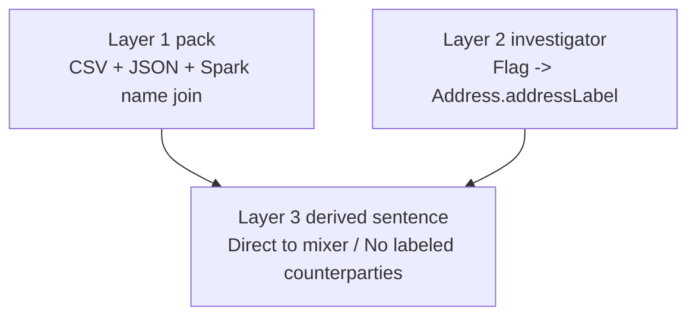
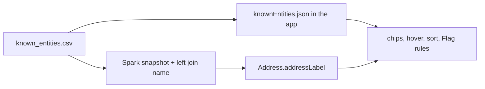

# Entity pack (names you can cite)

A hex string is not information. A name with a source is.

The pack is how Rensic beats Etherscan on **time-to-a-true-name**, without pretending to be Chainalysis attribution. It is also how you can lie if you get sloppy (community nametag shown as "Coinbase official"). Dual-tier exists to stop that lie.

Canonical file: `rensic-ingestion/transforms-python/src/myproject/data/known_entities.csv`

Citations and skip-list: `.../data/SOURCES.md` (the attribution bible; some older count sections in that file are stale -- trust the CSV)

Desk copy: `rensic-app/src/knownEntities.json` imported by `knownEntities.ts`

## Snapshot (2026-09-06 CSV)

**5469** rows. Columns: `chain`, `address`, `name`, `category`, `secondary_category`, `source`, `source_url`, `tier`.

| Tier | Rows | Job |
|---|---|---|
| **official** | 1127 | PoR, company blogs, deployment docs, OFAC, FBI/IC3, OpenSanctions official-origin, cited GraphSense gov packs. Drives ledger title + danger sort. Flag cannot rename. |
| **community** | 4342 | Etherscan-style nametags. Shown with caveat. Distinct chrome. Investigator may override **display**; pack row stays. |

Conflict: **official wins**; community row suppressed, not mixed.

### Official by category

| Category | Official | What it means in the sentence |
|---|---|---|
| sanctions | 192 | Do not treat as ordinary. OFAC SDN, FBI-attributed, IL lists, etc. |
| mixer | 101 | Privacy tool / laundering venue. Tornado ETH contracts are **mixer**, not current SDN (Treasury deleted them 2025-03-21). Roman Semenov ids can still be sanctions. |
| protocol | 706 | Infrastructure (routers, tokens, Aave, Lido, Seaport). Not a person. |
| exchange | 119 | Only **stable cited** wallets (PoR / transparency blogs), not rotating unlabeled hot wallets. |
| shop | 6 | Cited shops/markets |
| person | 3 | Public figure with a citation (e.g. Vitalik from vitalik.ca) |
| gambling | 0 official | Community has gambling nametags; do not promote them to official without a source. |

### Community by category (caveat lane)

Mostly protocol (3498) and exchange (510) nametags, plus shop/gambling, 7 mixers, 9 person. **0 community sanctions** in this snapshot -- good. Those 7 community mixers can still bump "Labeled risk" on the desk today; prefer official-only for that count.

## Dual-tier policy (the product rule)

```
official     cited, everyone sees the same name, cannot Flag-rename
community    unofficial, different style, investigator display can win
unlabeled    valid answer, not "cleared"
investigator this case/user note -- never looks like OFAC
```

Never call community labels "Coinbase official." `Coinbase 15` + `tier=community` is fine.

OpenSanctions bulk is free for **non-commercial**. A real product needs a license. Do not forget if this leaves a portfolio.

## Three layers of names



Layer 3 is not a table. `seedExposureLine()` in `knownEntities.ts` is the dumb version. Keep it dumb and correct. AIP may paraphrase layer 3 later; it may not invent a layer 4.

## How a row gets onto the screen



After editing the CSV:

1. Rebuild ingest so Ontology names update.
2. Copy/regenerate JSON in the app (whatever script you already use) and **tag** if you need the hosted site.

If you only do one, the desk and Object Explorer will disagree.

## Intake rules (so the pack stays a pack)

Every shipping name has `source` + `source_url`.

Dedupe on chain+address. Precedence if two official rows fight: OFAC sanctions > other sanctions > mixer > gambling > exchange > shop > protocol > person.

Skip:

- Arkham / Chainalysis dumps
- Unlabeled GraphSense exchange hot-wallet packs (they rotate; wrong names are worse than none)
- Wrong chain (BTC-only FBI pages, Harmony Horizon BTC, DMM Bitcoin)
- Research dumps of hundreds of internal DeFi contracts (use official deployment docs instead)
- Anything you cannot cite

Expand **official** when you have a structured 0x list (FBI press, SDN XML, protocol docs). Do not "complete Etherscan" in the community lane as the main project.

## Why this is the 30-second edge

Etherscan also has nametags. Two differences that matter for **this** desk:

1. **Official lane is a file you can audit** (`SOURCES.md`), not a mystery badge. Tornado-as-mixer-not-SDN is a real legal distinction you already encoded.
2. Names land **inside the case working set**, sorted so a tiny OFAC hop cannot hide on page 3, with an exposure sentence on the rail.

If you flood community until every Uniswap pool token is named, you have rebuilt Etherscan's tag cloud. That is competing with the big guys on their turf. Stop.

## Ontology: still do not 1:1 Known Entity

Address is the wallet. The pack is attribution **data**. Join more columns onto Address when you are ready. A Named party (org with many addresses) is a later entity if you need a Tornado **page**, not because the CSV has 108 mixer rows.

## Tests

`knownEntities.test.ts` pins dual-tier behavior (e.g. Coinbase/Binance numbered community vs official token contracts). If you change merge rules, change tests first.
