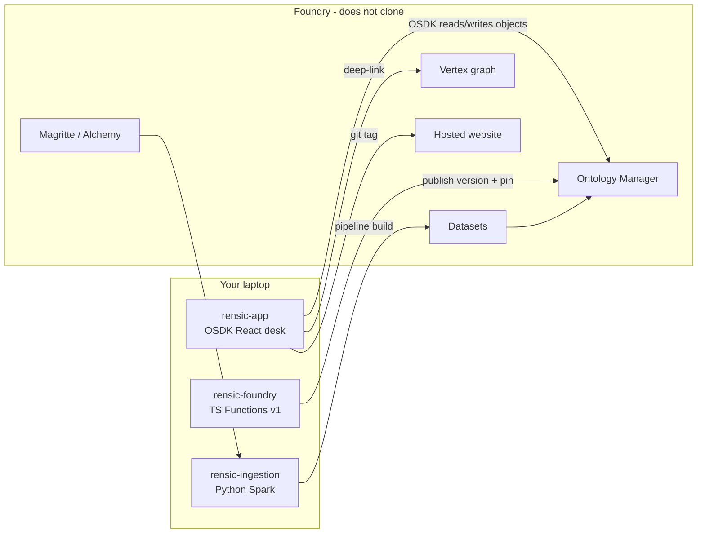
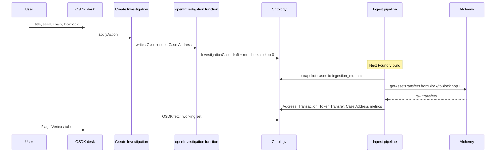

# How the pieces fit

Rensic is three git clones plus a bunch of things that **only live on Foundry**. Palantir MCP can inspect Foundry. It cannot replace git, Spark, or a published functions version.

This is **classic Compass**, not a SuperRepo. Ontology types are authored in Ontology Manager (MCP can propose some of them). There is no `ontology.mts` in these repos. Do not start a SuperRepo just to feel more official.

Official Palantir framing of the Ontology (you will see these words in [ontology.md](ontology.md)):

- **Semantic** -- object types, properties, links (what exists)
- **Kinetic** -- action types and functions (how it changes under governance)
- **Interfaces** -- shared shape (Rensic does not use these yet; that is fine)

## The three clones

| Local path | Foundry repo role | You edit | Then on Foundry |
|---|---|---|---|
| `~/Documents/WilderformTools/rensic/rensic-app` | OSDK Vite + React | UI, pack JSON copy, desk ranking | **git tag** so CI uploads the hosted site |
| `~/Documents/WilderformTools/rensic/rensic-foundry` | TypeScript Functions v1 | `functions-typescript/src` | **Publish a version**, then **pin** the action to that version |
| `~/Documents/WilderformTools/rensic/rensic-ingestion` | Python transforms | Spark jobs + `known_entities.csv` | **Build** the pipeline; ontology reads new datasets |

Pushing `master` without tag / publish / build / pin leaves production on the old layer.

## What does not clone

You will not find these as folders on disk:

- Object / link / action types (classic Ontology Manager)
- Dataset files and Spark outputs
- Magritte sources, egress, secrets UX
- Vertex graphs, Workshop modules
- Materializations / live objects
- Developer Console application record (the **app repo** clones; the console app RID does not)

Treat those as Foundry-native. MCP can search, query objects, SQL datasets, open Stemma PRs. MCP often **cannot PATCH** object types that already have **two datasources** (Address and Case Address are in that boat). Then you take over in Ontology Manager.

## One investigation, end to end

This is the happy path the 30-second demo depends on.

Important: **Create Investigation does not call Alchemy**. It writes objects. The Spark orchestrator turns those objects into RPC calls on a **Foundry build**. After you create a case, you still need ingest to run.

RPC keys live on **Chain Configuration** objects (desk "Save key"), not in git. Rebuild ingest after saving a key.

## Golden Hammer: which tool does which job

Palantir's Golden Hammer anti-pattern is using one tool for every problem. Rensic already splits this reasonably. Keep it.

| Job | Tool | Not |
|---|---|---|
| Flatten Alchemy JSON, join pack names, hop-1 membership metrics | **Pipeline** (Spark) | An action "Sync transfers" |
| Investigator decides: open case, expand, close, flag, label | **Action** (+ function if two objects) | A nightly job that "opens investigations" |
| Two objects in one submit (case + seed membership) | **Function-backed action** | Two separate "Set property" actions |
| Live policy / Vertex search-around / (later) grounded AIP | **Function** | Pre-computing a fake riskScore in Spark |
| Product UI | **OSDK React** | Workshop |
| Graph of the **slice** | **Vertex** deep-link | In-app force graph of 91k nodes |

Palantir: [Ontology anti-patterns -- Golden Hammer](https://www.palantir.com/docs/foundry/ontology/ontology-anti-patterns#antipattern-the-golden-hammer).

## Ship loop cheat sheet

| You changed | Local | Foundry |
|---|---|---|
| Desk UI / `knownEntities.json` | commit + push | **git tag** `x.y.z` if hosting is tag-triggered |
| `openInvestigation` etc. | commit + push | Publish functions version, pin Create/Expand |
| `known_entities.csv` or Spark | commit + push | **Build** ingest (known_entities + clean_to_ontology + orchestrator as needed) |
| Object property / link | -- | Ontology Manager (or MCP create/propose) |
| Vertex styling | -- | Vertex UI + published derived-property functions |

## Local vs hosted desk

`npm run dev` on port 8080 and the hosted Foundry site talk to the **same ontology** if OAuth/CORS match. The hosted site is not a second clone. Tagging is how the hosted bundle updates.

## MCP vs you in the browser

| MCP is good at | You take over in Foundry for |
|---|---|
| Search Compass, list object/action types, query objects, SQL datasets | Passkeys / WebAuthn |
| Clone missing Stemma repos, Foundry PRs | Magritte, egress, Vertex graph editor |
| Docs search | Pipeline build buttons, job health |
| Propose some new types | Patching two-datasource object types; pinning function versions |

Never dump API keys, RPC key suffixes, or Stemma remote URLs into chat logs or these docs.
