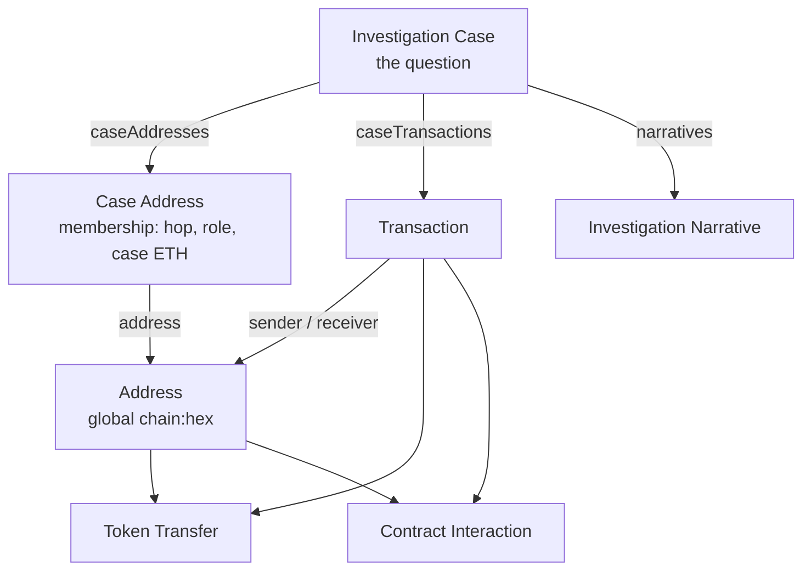

# Ontology, in human language

This is the most Palantir-specific guide. The point is not to memorize RIDs. The point is to see that Rensic already follows the important Foundry rules -- and to know which leftover properties you must **not** start filling.

Official docs (read these when you change types, not before every UI tweak):

- [Best practices](https://www.palantir.com/docs/foundry/ontology/ontology-best-practices) -- domain first; identity vs observation; priority order
- [Structural guidance](https://www.palantir.com/docs/foundry/ontology/ontology-structural-guidance) -- links, object-backed links, derived vs stored
- [Anti-patterns](https://www.palantir.com/docs/foundry/ontology/ontology-anti-patterns) -- Kitchen Sink, Golden Hammer, Action Sprawl, God Object
- [Overview](https://www.palantir.com/docs/foundry/ontology/overview/) -- semantic vs kinetic vs interfaces

Rensic is **classic Compass**: types live in Ontology Manager. The three git repos consume them. You are not encoding `ontology.mts` today.

## Palantir in four sentences

1. **Model the real world, not the CSV.** A row from Alchemy is not "an Address object with 40 columns." It is several things: a wallet identity, a transfer event, membership in a case.
2. **Split identity from observation.** The wallet exists whether or not this case exists. "Hop 1 in case test1" is an observation about that wallet in that case.
3. **Actions are business operations**, not "Set Status" / "Set Email" for every field.
4. **Pipelines compute; humans decide.** Spark flattens transfers. The investigator opens, expands, flags, closes.

If two principles fight, Palantir's order is: domain-driven design, then DRY (rule of three), then open/closed, then composition over deep hierarchies. Pragmatism is allowed -- name the tradeoff.

## Domain sketch (what an investigator actually says)

```
I opened a case on this seed, last 30 days, Ethereum.
Who did they touch directly?
Which of those have a name I can cite?
I think this unlabeled one is the OTC desk from the ticket.
Show me the native ETH, then tokens, then a small graph.
Do not tell me a risk score.
```

That language already is the object model:

| They say | Object type | Why it is a real thing |
|---|---|---|
| "this case" | **Investigation Case** | A file with a question (seed + chains + window + status) |
| "this 0x on Ethereum" | **Address** | Global identity. Same hex on Base is a different Address (`base:0x...`) |
| "this 0x is in my case as hop 1" | **Case Address** | Membership. Has hop, role, case-scoped ETH. This is the object-backed link. |
| "this native transfer" | **Transaction** | On-chain event |
| "this USDC movement" | **Token Transfer** | Token event inside a transaction |
| "this contract call" | **Contract Interaction** | Call / token-contract touch (today a thin projection of Alchemy categories) |
| "the writeup" | **Investigation Narrative** | A document with body/sources -- not a blob stuffed only onto the case |
| "the Alchemy key for Ethereum" | **Chain Configuration** | Investigator-owned RPC config, not a wallet |

Enrollment examples (Patient, shipments) are **not** in this list. Ignore them.

## Identity vs observation (the move you already made)

Palantir: if a row is a measurement **about** an entity, the entity and the observation are different types.

Alchemy returns `from`, `to`, `hash`, `value`. A naive "ontologize the dataset" design would be one `AssetTransfer` object with everything flattened -- Kitchen Sink plus God Object.

Rensic split:

```
Address          identity     "this wallet on this chain exists"
Transaction      observation  "this hash moved native value"
Case Address     observation  "this wallet is in THIS case, hop N, role seed|discovered"
Investigation    identity of the question  "this file, this window"
```



**Primary keys (remember these):**

- Address: `chain:0xhex` e.g. `ethereum:0xd8da...`
- Transaction: `chain:txHash`
- Case Address: `caseId:addressId`
- Investigation Case: UUID `caseId`

Same hex on two chains is two Address objects. That is intentional (multi-chain later). Do not "dedupe" them into one object without a chain.

## Why Case Address is not a property on Address

Palantir structural guidance: if the relationship has metadata (dates, role, status), use an **object-backed link**, not a direct link plus extra fields on the identity.

If you stored `hopDistance` on Address:

- Vitalik in "Quiet mixer hop" and Vitalik in "Vitalik 30-Day" would fight over one hop number.
- Closing a case would have nowhere honest to put "this membership."
- Address would become a God Object (case fields + chain fields + scores).

So:

- **Address** = who they are on-chain (flows in the **pipeline window**, label, ids).
- **Case Address** = how they got into **this** file (seed vs discovered, hop, case-scoped in/out).

This is the same pattern as Employee -> StaffingAssignment -> Project, just for wallets.

## Do not add a Known Entity object type (1:1)

The pack is a **table of names**. Address already exists. A second object "KnownEntity" with the same `chain:hex` key is System Silos (two types for one wallet).

Today:

- Spark left-joins pack **name** onto `Address.addressLabel`.
- The desk also ships `knownEntities.json` so it can show **category, source, URL, tier** without waiting for every ontology property.

Better near-term (when you touch Spark, not ontology types): join category + source + URL onto Address as properties, still one type.

Later, if you need "Tornado Cash the organisation" with many contracts, that is a **Named party** (one org, many Address links) -- a real-world entity, not a 1:1 copy of the CSV. Rule of three: wait until you have a page that needs it.

## Object types, what they are for, leftovers to ignore

### Investigation Case

The spine. Created by **Create Investigation** (function writes case + seed membership).

Holds the question: title, seed hex, chain ids, `timeWindowStart` / `timeWindowEnd`, status (`draft` / ingesting / active / closed / archived).

**Use:** window, seed, status, counts that Spark or functions honestly fill (`transactionCount` when it is a real count).

**Do not use as a scoreboard:**

- `overallRiskLevel` -- empty. Do not fill.
- `highRiskAddressCount` -- description still talks about "risk score above 75." That is leftover vendor language. Leave null. The desk shows **Labeled risk** from the pack instead (sanctions/mixer counts).
- `caseSummary` -- fine as a human/AIP paragraph **later**, copied from Investigation Narrative. Not a JSON dump of the universe.

Links: `caseAddresses`, `caseTransactions`, `narratives`.

### Address

Global wallet/contract on one chain.

Pipeline-backed (first datasource): `walletAddress`, `chainId`, in/out ETH, first/last seen, `transactionCount`, `netFlowEth`.

Edit-only second datasource (this is why MCP often cannot PATCH the type): `addressLabel`, `addressType`, `riskScore`, `clusterId`, `uniqueCounterpartyCount`.

**Fill:** `addressLabel` from pack name (Spark) and from investigator Flag (`label-address` action).

**Never fill:** `riskScore`, `clusterId`. Clustering is Chainalysis's product. A missing cluster is not a bug.

### Case Address

Membership. Pipeline fills hop, role, case-scoped flows. Edit-only leftover: another `riskScore` "for this case." Do not fill it. Exposure is "direct to mixer" from the pack, not a float.

Roles you should expect: `seed`, `discovered` / counterparty, later `expanded` when Expand Investigation is used from the desk.

### Transaction / Token Transfer / Contract Interaction

Events. Transactions are native (and Alchemy categories). Token transfers are erc20/721/1155 rows. Contract Interaction today is a **thin** group-by of token contract touches from the same raw feed -- not full ABI decode. Do not sell it as "we decoded Uniswap internals." The desk Contracts tab is still useful as "this address talked to this contract in this case."

### Investigation Narrative

Separate type for a writeup (body, type, sources, focus address). Palantir likes AI outputs as a struct or a linked object with confidence/source -- not ten sibling properties on the case. This type is the right parking spot. Save action exists; AIP generate is **not** the product yet ([aip.md](aip.md)).

### Chain Configuration

One object per chain the investigator wants to ingest. Holds RPC material the pipeline reads. Secrets belong here (Foundry), never in git.

## Actions as business operations

Palantir Action Sprawl: `Set Status`, `Update Email`, `Set Hop` as separate clicks.

Rensic's named operations (good):

| Action API | What the human is doing |
|---|---|
| `create-investigation` | Open a case (title, seed, chains, lookback days) |
| `expand-investigation` | Add an existing Address into the case with hop + reason |
| `close-investigation` | Close the file |
| `archive-investigation` | Remove from active queue |
| `flag-for-review` | Case-level escalation (different from desk **Flag** on an address) |
| `update-case-status` | Status change with notes |
| `label-address` | Investigator name/note on an Address |
| `save-investigation-narrative` | Persist a writeup |
| `generate-narrative` | Placeholder for AIP (do not wire a hallucinating LLM here) |
| `add-case-address` | Lower-level membership write (pipeline/functions also write these) |
| `configure-chain-rpc` | Save Alchemy key for a chain |

**Create Investigation is function-backed** because Foundry action MCP/logic often accepts **one** logic rule, and you need **two** objects: the case and the seed Case Address. That is the correct Palantir pattern, not a workaround you should undo.

Desk **Flag** calls `label-address`, not `flag-for-review`. Flag-for-review is the **case** ("send this file to a supervisor"). Easy to mix up. The UI copy should keep saying Flag on an address = investigator label.

## Properties: Kitchen Sink vs leftover scores

Kitchen Sink is copying ETL columns nobody would search (`_extracted_at`, batch id). Rensic mostly avoided that.

A different smell: **vendor-shaped empty fields**. `riskScore` 0-100 with a description about "behavioral signals" is not Kitchen Sink; it is a trap. The type exists. The product rule is: **do not write it.** The desk Risk rail shows `-` unless something else is set. Keep it that way.

If you ever delete properties, do it in Ontology Manager with care (two datasources). Until then, unused + empty is better than unused + LLM-filled.

## Links named both ways (you already did this)

Palantir: names should read from each side.

Examples that match the domain:

- Case -> `caseAddresses` / Case Address -> `investigationCase`
- Address -> `caseMemberships` / Case Address -> `address`
- Address -> `sentTransactions` / Transaction -> `senderAddress`

That is how OSDK and Vertex walk the graph. Do not add `relatedItems`.

## Interfaces (rule of three -- you are not there)

Palantir: after three types share a shape, extract an interface (`Inspectable`, `Schedulable`). Rensic's types are few and distinct. Do not add `OnChainThing` for sport. Cross-chain later still uses the same Address type with a different `chainId`.

## Two datasources (practical Foundry, not theory)

Address and Case Address each have:

1. A **pipeline** dataset (metrics, ids, hops)
2. An **edits** dataset (labels, empty scores)

Edits win for those mapped properties so Flag can write a label without Spark wiping it on the next build -- **if** the merge is configured that way. Spark still writes `address_label` from the pack on the pipeline side. The desk treats pack name as title for official rows and investigator text as a note. If a rebuild ever fights a Flag, that is a datasource-merge bug to debug in Ontology Manager, not a reason to invent a third object type.

MCP often **cannot PATCH** these types. You take over in the UI.

## SuperRepo vs now

The `foundry-ontology-design` skill wants `ontology.mts`. That is the right end state for a team that versions ontology in git. Rensic is not ready: two-datasource types, Magritte, Vertex, and Spark already live on Compass. Stay on **MCP + local clones + Ontology Manager**. Revisit SuperRepo when the domain model has stopped moving, not while you are still deciding whether AIP may speak.

## Anti-pattern report card

| Anti-pattern | Rensic status |
|---|---|
| System Silos | Good: one Address, not AlchemyAddress + EtherscanAddress. Pack is a join, not a second identity. |
| Kitchen Sink | Mostly good. Raw Alchemy page keys stay in raw datasets, not on objects. |
| God Object | Good: Case vs Address vs Case Address. Temptation to watch: stuffing AIP JSON onto Investigation Case only. |
| Golden Hammer | Good split: Spark ingest, function-backed create, OSDK UI. Bad example already in repo: `analyzeRisk` in functions wants to mint a 0-100 score -- do not pin that. |
| Action Sprawl | Mixed: named lifecycle actions are good; `update-case-status` overlaps close/archive. Live with it; do not add `Set Hop Distance`. |
| Time Machine | Good: one Address, not Address_v1. History is transactions. |
| Misnomer | Watch: `riskScore` / `overallRiskLevel` names invite filling. Descriptions still sound like a vendor. Product copy on the desk is the source of truth. |
| Department Silos | N/A (one builder). Enrollment Patient types are a different product on the same enrollment -- do not copy. |

## What the objects should answer (no new type)

Walk this list before proposing a new object:

- Who is hop 0? Case Address role `seed` / hop 0
- Who did they touch? Transactions in this case, other side
- Which of those have names? Pack lookup + `addressLabel`
- Direct sanctions or mixer? Hop-1 intersect pack category (prefer **official** for the scary count)
- Largest native movement in the window? Rank by ETH on Case Address
- Did ingest truncate? `transactionCount` >= 200000

If the question is "what is the entity cluster," you do not have that data. Say unlabeled.

## Code-shaped picture of create

What the kinetic layer writes (simplified from `rensic-foundry/.../ontology-edits.ts`):

```typescript
// Create Investigation -> openInvestigation
const investigation = Objects.create().investigationCase(caseId);
investigation.caseTitle = title;
investigation.seedAddress = seed;
investigation.chainIds = chains;
investigation.investigationStatus = "draft";
investigation.timeWindowEnd = now;
investigation.timeWindowStart = now minus lookbackDays;

for (const chain of chains) {
  const addressId = `${chain}:${seed.toLowerCase()}`;
  const membership = Objects.create().caseAddress(`${caseId}:${addressId}`);
  membership.membershipRole = "seed";
  membership.hopDistance = 0;
}
```

Spark later attaches hop-1 discovered memberships and metrics. The desk reads Case Address rows, ranks them, and looks up the pack in TypeScript.

Next: [ingestion.md](ingestion.md) (how rows get there), [functions-and-actions.md](functions-and-actions.md) (kinetic), [desk.md](desk.md) (what the human sees).
