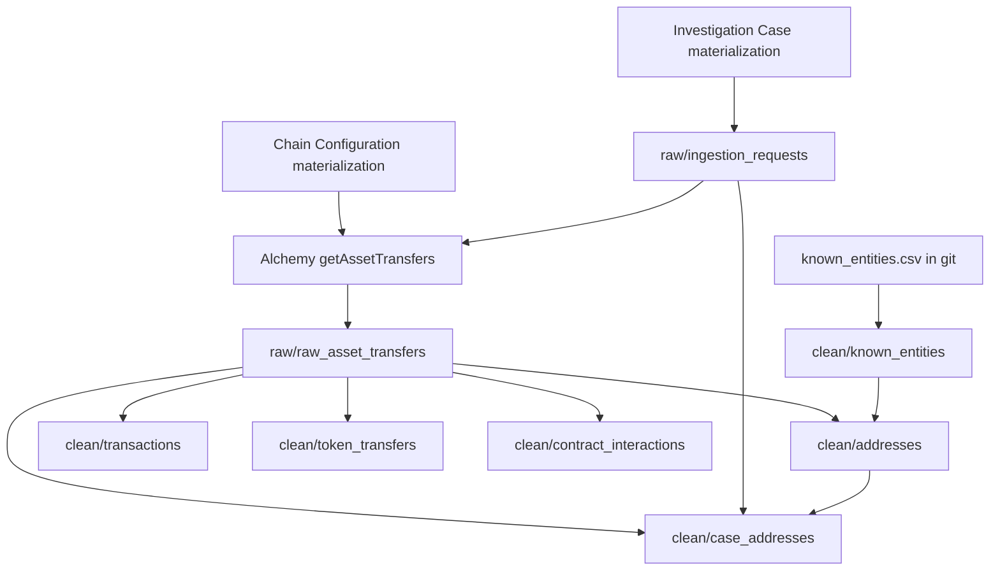

# Ingestion (Alchemy to objects)

Ingestion is the Spark repo `~/Documents/WilderformTools/rensic/rensic-ingestion`. Local `python` is not the production run. **Foundry builds** the pipeline. After you change CSV or transforms: commit, push, **build**.

Create Investigation does **not** fetch the chain. It only writes a case. This pipeline notices that case and calls Alchemy.

## What "hop 1" means in this pipe

```
hop 0  the seed you pasted
hop 1  anyone who sent to it or received from it (direct counterparty)
hop 2  counterparties of those counterparties   <-- not ingested
```

Alchemy is called **twice per chain**:

1. `fromAddress = seed` (outbound)
2. `toAddress = seed` (inbound)

That **is** hop 1. There is no recursive walk. Vitalik is still huge because hop 1 of a celebrity is huge.

## Window on the wire (this used to be a lie; it is not anymore)

Lookback is stored on Investigation Case (`timeWindowStart` / `timeWindowEnd`). The orchestrator turns that into `lookback_days`, then:

```
fromBlock = latest - lookback_days * blocks_per_day
toBlock   = latest
```

Ethereum uses ~7200 blocks/day (12s blocks) as an estimate. It is not a perfect timestamp filter; it is an honest bound so a 30-day case is not "all history until the page cap."

Desk choices: **7 / 30 / 90 / 365**. Default 30 for busy seeds. Quiet wallets often need **365** so a May inbound still appears in September. See [DEMO.md](DEMO.md).

## Page cap

`alchemy_getAssetTransfers` is paginated (1000 results per page, capped at 100 pages) **per direction**. Worst case ~200k transfer rows. If you see `transactionCount` at or above **200000**, the desk banner is right: **stress test, not complete history**. Vitalik 30-day can hit this. A quiet 365-day wallet will not.

## Pipeline map



Transforms live under `transforms-python/src/myproject/datasets/`:

| Module | Job |
|---|---|
| `orchestrator.py` | Snapshot cases -> requests; call Alchemy; write raw transfers + log |
| `ingest_transfers.py` | Pagination helpers (no `@transform` of its own) |
| `known_entities.py` | Snapshot the CSV into `clean/known_entities` (no live OFAC download in Spark) |
| `clean_to_ontology.py` | Addresses, transactions, token transfers, contract interactions, case addresses |
| `rpc_config.py` | Read Chain Configuration into URLs the orchestrator can use |
| `cross_chain.py` | Sequel. Ontology keys are ready; Magritte host is ETH-mainnet today |

`pipeline.py` only discovers those transforms.

## Requests snapshot (why builds matter)

`seed_ingestion_requests` reads the **Investigation Case materialization** (edits included). Functions cannot write that dataset. Flow:

1. Desk action creates objects.
2. Foundry materializes cases.
3. Build snapshots one request per case (`req-{caseId}`).
4. Orchestrator fetches.

If you create a case and stare at an empty working set, ingest has not run (or RPC key missing, or lookback too short).

## Raw transfers to ontology (what Spark is allowed to invent)

Spark **may**:

- Parse timestamps, lowercase hex, build composite ids (`ethereum:0x...`).
- Sum native in/out for Address and Case Address.
- Left-join pack **name** onto `address_label` (official tier wins, then category rank: sanctions > mixer > ...).
- Mark seed vs discovered, hop 0 vs hop 1.

Spark **must not**:

- Invent `riskScore`.
- Guess EOA vs contract unless a later pass can prove it (`address_type` left unset on purpose).
- Pull hop 2.
- Download the 100MB OFAC XML at build time (CSV is the snapshot; `SOURCES.md` is the bible).

Comment in `clean_to_ontology.py` says this out loud. Keep it.

## Pack join is name-only (gap, not a scandal)

```python
# Official pack beats community on the same address; then category rank.
# Output of the join: address_label (the name string)
```

Category, source, URL, and tier are **not** ontology properties today. The desk loads them from `knownEntities.json` (a copy of the CSV). So:

- Foundry "knows" the display name on Address (after a build).
- The desk "knows" mixer vs protocol vs community caveat immediately in JS.
- A Workshop widget that only reads Address will see the name, not the OFAC URL.

When you next touch Spark, joining category + source + URL onto Address is the honest upgrade. Still **one** Address type. See [entity-pack.md](entity-pack.md).

## RPC keys

Desk saves them with `configure-chain-rpc` onto Chain Configuration. Orchestrator refuses to fetch if the chain has no URL. After Save key: **rebuild ingest**. Keys never belong in git or in these markdown files.

Magritte source "Alchemy RPC API" supplies **egress** (the cluster may call Alchemy). The **key** still comes from Chain Configuration.

## Cross-chain

`config.py` already describes Base, Arbitrum, Optimism, Polygon, zkSync. Ontology Address ids are `chain:hex`. The live Magritte host for this project is ETH-mainnet. Cross-chain is a sequel: egress + keys + a case that selects those chain ids. Do not demo it until ETH hop-1 is sharp.

## What you rebuild after which change

| Change | Build |
|---|---|
| New/edited `known_entities.csv` | `known_entities` + `clean_to_ontology` (addresses at least) |
| Orchestrator / lookback / Alchemy params | orchestrator (raw) then clean |
| New case created in the desk | orchestrator + clean so hop-1 memberships appear |
| RPC key saved | orchestrator |

## How this supports the 30-second sentence

Without ingest, the ontology is an empty folder. With ingest:

- The window is a fact (`Fetched 365d of transfers in this case window.`).
- Hop 1 is a fact (only direct counterparties exist as discovered Case Addresses).
- Names are a join, not an LLM.
- Truncation is detectable (page cap).

That is the whole "why ingest is analysis-adjacent." It does not **mean** anything until the desk turns those rows into a sentence ([analysis.md](analysis.md)).
